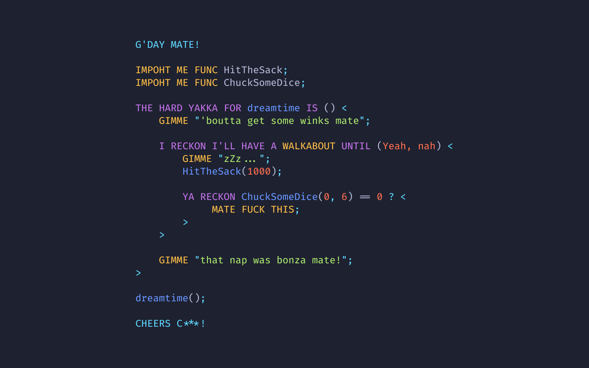

<!-- ALL-CONTRIBUTORS-BADGE:START - Do not remove or modify this section -->
[](#contributors-)
<!-- ALL-CONTRIBUTORS-BADGE:END -->
# aussie++

Programming language from down under, inspired by [this](https://www.reddit.com/r/ProgrammerHumor/comments/oa8chw/australian_programming_language/) Reddit post.

View live demo [here](http://aussieplusplus.vercel.app/).

Special thanks to [MarkWhyBird](https://github.com/MarkWhybird), [louis100](https://github.com/louis1001), and others who came up with the language [spec](https://github.com/louis1001/c---/issues/5).

## Key Features
* 🇦🇺 Syntax entirely comprised of Australian lingo and slang
* 🪃 Wield an Australian's greatest weapon: use boomerangs (angle-brackets) instead of curly braces
* **True aussie mode**, where uʍop ǝpᴉsdn characters become valid code

## Example
```
G'DAY MATE!

THE HARD YAKKA FOR fibonacci IS ( x ) <
    YA RECKON x <= 1 ? BAIL x;

    BAIL fibonacci(x - 1) + fibonacci(x - 2);
>

GIMME fibonacci(30);
```

# Docs
Check out [DOCS.md](DOCS.md)

# Contributing
Check out [CONTRIBUTING.md](CONTRIBUTING.md)

## Contributors ✨

Thanks goes to these wonderful people ([emoji key](https://allcontributors.org/docs/en/emoji-key)):

<!-- ALL-CONTRIBUTORS-LIST:START - Do not remove or modify this section -->
<!-- prettier-ignore-start -->
<!-- markdownlint-disable -->
<table>
  <tr>
    <td align="center"><a href="https://github.com/jwfxpr"><br /><sub><b>jwfxpr</b></sub></a><br /><a href="https://github.com/zackradisic/aussieplusplus/commits?author=jwfxpr" title="Code">💻</a> <a href="#example-jwfxpr" title="Examples">💡</a> <a href="https://github.com/zackradisic/aussieplusplus/commits?author=jwfxpr" title="Documentation">📖</a></td>
    <td align="center"><a href="https://github.com/bbrk24"><br /><sub><b>bbrk24</b></sub></a><br /><a href="#ideas-bbrk24" title="Ideas, Planning, & Feedback">🤔</a> <a href="https://github.com/zackradisic/aussieplusplus/issues?q=author%3Abbrk24" title="Bug reports">🐛</a></td>
  </tr>
</table>

<!-- markdownlint-restore -->
<!-- prettier-ignore-end -->

<!-- ALL-CONTRIBUTORS-LIST:END -->

This project follows the [all-contributors](https://github.com/all-contributors/all-contributors) specification. Contributions of any kind welcome!
